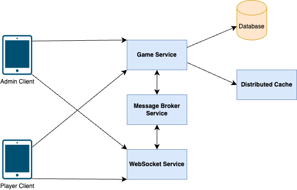

# Quiz Game

## Introduction

Quiz Game is a web application that allows you to play quiz with others.

This is a project to study event driven architecture, aim to build a real-time quiz game.

## Features

### 1. Admin

- Create quiz
- Observe leaderboard
- End quiz

### 2. User

- Join quiz
- Answer question
- Score
- Observe leaderboard

<video src="./document/demo.mov" width="640" height="480" controls></video>

## Development

### 1. Components

- Client web application: HTML, CSS, JavaScript
  - Folder ./client/
- Web socket server: ExpressJS
  - Folder ./ws_service/
- Game service: ExpressJS
  - Folder ./game_service/

### 2. Prerequisites

- NodeJS
- Redis (for message broker and distributed cache)

### 3. Run project

1. Start Redis.
2. In each component folder, there is a configs.json file at {component_folder}/config/configs.json. Config the host as desired.
3. Enter `npm install` in each component folder to install dependencies.
4. Enter `node index.js` in each component folder to start the service.

### 4. APIs and Messages

#### 4.1 APIs of game service

+ Create new game: POST /api/v1/games
+ Get game info: GET /api/v1/games/{game_id}
+ Get game leaderboard: GET /api/v1/games/{game_id}/leaderboard

#### 4.2 Messages published by websocket service (subscribed by game service)

+ user_join
+ get_question
+ answer_question
+ end_game
  
#### 4.3 Messages published by game service (subscribed by websocket service)

+ leaderboard_update
+ send_question
+ send_answer_result
+ user_end_quiz
+ service_end_game

#### 4.4 Messages sent by client via socket

+ get_question
+ answer_question
+ end_game

#### 4.5 Game event sent by websocket service via socket

+ connected
+ leaderboard_update
+ receive_question
+ answer_result

## LICENSE
ISC

